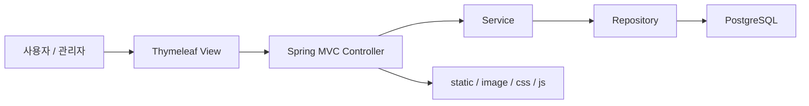
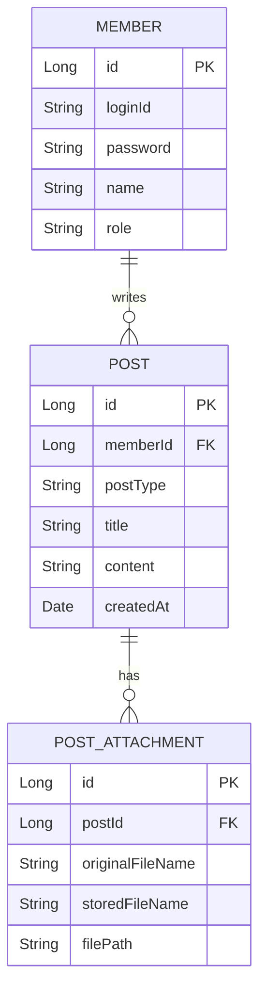

# Incheon Culture Tour Web Application

인천 문화관광 정보를 제공하는 팀 프로젝트입니다. 정적 퍼블리싱 결과물을 기반으로 Spring Boot 3, Thymeleaf, PostgreSQL을 적용해 회원, 게시판, 관리자 기능까지 확장한 웹 애플리케이션입니다.

## 1. 프로젝트 개요

- 프로젝트명: 인천 문화관광 웹 애플리케이션
- 개발 형태: 팀 프로젝트
- 팀명: 연연생트리오
- 주제: 인천 지역 관광, 문화행사, 교통, 맛집, 숙박, 쇼핑 정보 제공
- 개발 목적: 관광 정보 페이지와 회원/게시판 기능을 결합한 Spring Boot MVC 웹 서비스 구현
- 저장소: https://github.com/woongpro416/Incheon_Culture-Tour

## 2. 주요 기능

- 인천 안내, 테마여행, 문화관광, 교통, 맛집/숙박/쇼핑 콘텐츠 페이지
- 회원가입, 로그인, 로그아웃, 마이페이지 수정, 회원 탈퇴
- 공지사항 목록/상세/작성/수정/삭제, 검색, 첨부파일 업로드
- 리뷰 게시판 목록/상세/작성/수정/삭제, 검색, 첨부파일 업로드
- 관리자 권한 기반 공지사항 관리와 회원 관리
- 개인정보처리방침, 저작권보호정책 등 정책 페이지

## 3. 담당 역할

- 관광 정보 정적 페이지와 콘텐츠 레이아웃 구현 참여
- Spring Boot MVC 구조에서 화면 템플릿과 기능 흐름 통합 참여
- 회원/게시판/관리자 기능 테스트 및 산출물 정리 참여
- README, 실행 방법, 프로젝트 구조, 시연 자료 정리

## 4. 기술 스택

| 영역 | 기술 |
| --- | --- |
| Frontend | HTML5, CSS3, JavaScript, Thymeleaf |
| Backend | Java 21, Spring Boot 3, Spring Web, Spring Security |
| Database | PostgreSQL, Spring Data JPA |
| Build | Gradle |
| Infra | Docker |
| Docs | Notion, README, GIF 시연 자료 |

## 5. 시스템 아키텍처



## 6. ERD



실제 entity는 `Member`, `Post`, `PostAttachment` 중심이며 공지사항과 리뷰는 `postType` 또는 서비스 계층의 분류 기준으로 나뉩니다. README의 ERD는 포트폴리오 설명용 요약입니다.

## 7. API 명세

서버 사이드 렌더링 방식이므로 REST API보다 MVC route 중심입니다.

| 기능 | Method | Path 예시 |
| --- | --- | --- |
| 메인 | GET | `/` |
| 회원가입 화면/처리 | GET/POST | `/member/join` |
| 로그인 화면/처리 | GET/POST | `/member/login` |
| 마이페이지 | GET/POST | `/member/mypage` |
| 공지사항 목록/상세 | GET | `/notice`, `/notice/{id}` |
| 공지사항 작성/수정/삭제 | GET/POST | `/notice/write`, `/notice/edit/{id}`, `/notice/delete/{id}` |
| 리뷰 목록/상세 | GET | `/review`, `/review/{id}` |
| 리뷰 작성/수정/삭제 | GET/POST | `/review/write`, `/review/edit/{id}`, `/review/delete/{id}` |
| 정책 페이지 | GET | `/policy/privacy`, `/policy/copyright` |

정확한 route는 controller 소스 기준으로 확인합니다.

## 8. 실행 방법

PostgreSQL DB를 생성합니다.

```sql
CREATE DATABASE incheon;
```

`incheon/src/main/resources/application.yaml`의 DB 접속 정보를 환경에 맞게 확인합니다.

```yaml
spring:
  datasource:
    url: jdbc:postgresql://localhost:5432/incheon
    username: postgres
    password: 1004
```

로컬 실행:

```bash
cd incheon
./gradlew bootRun
```

Windows:

```bash
cd incheon
gradlew.bat bootRun
```

접속 주소:

```text
http://localhost:8184
```

## 9. 테스트 / 검증 방법

- 회원가입, 로그인, 로그아웃, 마이페이지 수정 흐름 확인
- 비회원/회원/관리자 권한별 접근 가능 화면 확인
- 공지사항과 리뷰 게시판 CRUD, 검색, 첨부파일 업로드 확인
- PostgreSQL에 회원, 게시글, 첨부파일 데이터가 저장되는지 확인
- GIF 시연 자료 기준으로 주요 화면 동작 재현

## 10. 트러블슈팅

- 정적 퍼블리싱 파일을 Thymeleaf 템플릿으로 확장하면서 정적 리소스 경로와 template 경로를 분리했습니다.
- 회원/관리자 권한이 섞이지 않도록 Spring Security 접근 제어를 적용했습니다.
- 게시판 첨부파일은 `PostAttachment`에는 메타데이터, 서버 파일 시스템에는 실제 파일을 저장하는 방식으로 책임을 나눴습니다.
- 관광 콘텐츠와 게시판 기능이 섞이지 않도록 controller/service/repository 계층을 분리했습니다.

## 11. 배포 / 링크

- GitHub: https://github.com/woongpro416/Incheon_Culture-Tour
- Front Page: https://teamweb802.github.io/teamweb01/
- Docker Image: `teamweb802/tour-incheon:1.0`
- Notion 산출물: https://www.notion.so/15972bc8fbb78217aaa601ec207feadf

Docker 실행 예시:

```bash
docker pull teamweb802/tour-incheon:1.0
docker run -p 8184:8184 teamweb802/tour-incheon:1.0
```

## 12. 한계와 개선 방향

- 관광 정보는 정적 콘텐츠 중심이라 최신 데이터 자동 갱신이 어렵습니다.
- 관리자 기능은 공지사항과 회원 관리 중심으로, 콘텐츠 운영 기능은 추가 확장이 필요합니다.
- API 명세가 Swagger 형태로 분리되어 있지 않아 controller 기준 문서화가 필요합니다.
- 추후 관광 API, 지도 API, 검색 필터, 접근성 개선을 적용하면 서비스 완성도를 높일 수 있습니다.